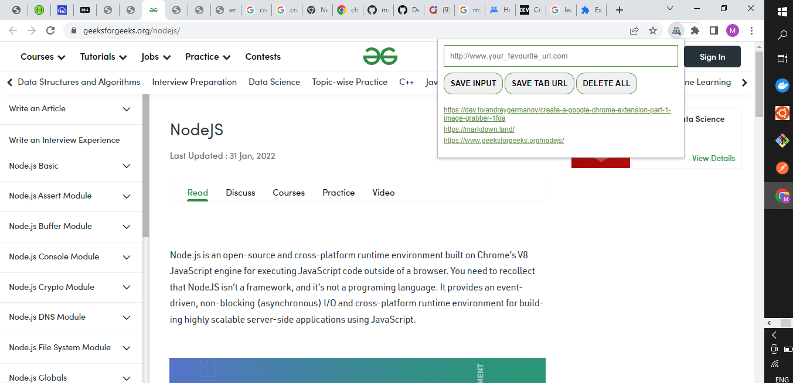

# CHROME LEADS TRACKER EXTENSION
This extension helps you save leads/urls to visit at later time.


## Installing the project
---
Clone the repository to your local machine by running the command in your CLI (terminal). For this command to work you must have git installed. To download click [here](https://git-scm.com/downloads).

```
git clone https://github.com/malachi43/chrome-extension.git
```


Now the repository is in your local machine, navigate to **manifest.json** file and make the necessary changes that suit your needs.

Edit the name and default_icon properties to your preference. Note the **default_icon** property should be a **.png** image for the image to render as your extension icon.

#### **manifest.json file**
```
{
    "manifest_version": 3,
    "version": "1.0",
    "name": "Leads tracker",
    "action" : {
        "default_popup": "index.html",
        "default_icon": "./leads.png"
    },
    "permissions": [
        "tabs"
    ] 
    
}
```


## Adding the extension to your chrome browser
---
1. Open your chrome browser.
2. Click on the puzzle icon at the top right corner of your chrome browser.
3. A pop-up opens. On the pop-up click on **Manage extensions**.
4. A new window opens. Click on **Load unpacked** tab at the top of the window that opens a file chooser, from this choose your cloned repository/folder to add it as an extension to your chrome browser.
5. Click on the puzzle icon again to see your just added extension with the name  and icon set in the manifest.json file.
6. Your new extension is ready to use.


You should have the below extension display when you click on your extension puzzle icon:

